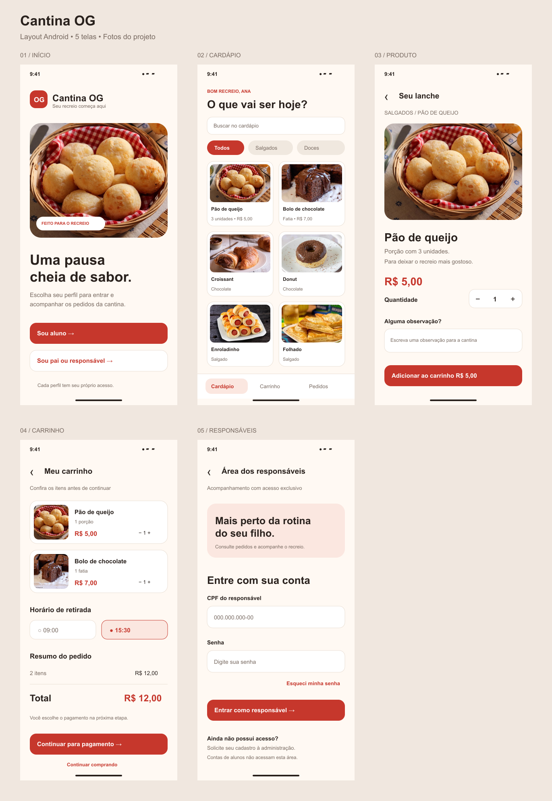

# Layout Cantina OG para Figma

Cinco telas do aplicativo Android: início, cardápio, produto, carrinho e acesso dos responsáveis. O layout utiliza as seis fotos de alimentos do projeto.

## Importar no Figma

1. Baixe [Cantina-OG-para-Figma.zip](Cantina-OG-para-Figma.zip) pelo botão de download do GitHub e extraia os arquivos.
2. Abra um arquivo de design no Figma.
3. Arraste os cinco arquivos `tela-1.svg` a `tela-5.svg` para o canvas.

Para criar camadas nativas editáveis, use o Figma Desktop: **Plugins > Development > Import plugin from manifest**, selecione `manifest.json` extraído e execute **Cantina OG • Importar layout**. O importador cria uma nova página com cinco frames de 390 × 844 px, textos, formas e imagens.

O pacote também contém instruções detalhadas em `LEIA-ME.md`. A sintaxe do importador foi verificada; sua execução dentro do Figma ainda não foi validada.

## Escopo

Esta é uma proposta visual para importação, não um arquivo publicado na conta Figma. As telas não contêm autenticação real, transações nem conexões de protótipo. A recuperação de senha é uma proposta de interface.

Os preços do pão de queijo (R$ 5,00) e do bolo (R$ 7,00) correspondem ao catálogo SQL enviado. Os outros quatro alimentos aparecem sem preços definidos. O carrinho ilustrativo soma R$ 12,00.
